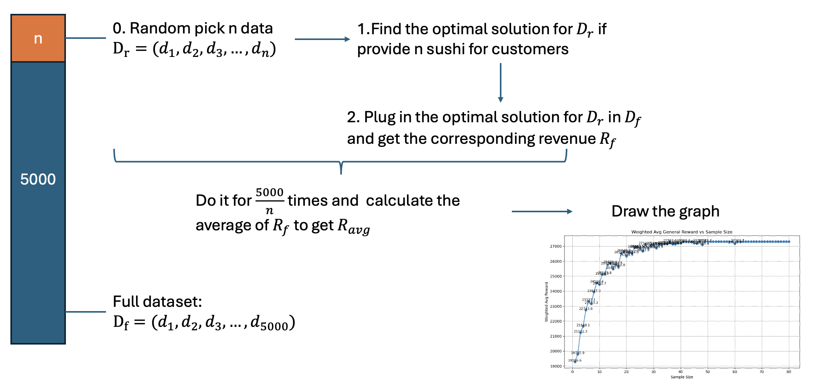
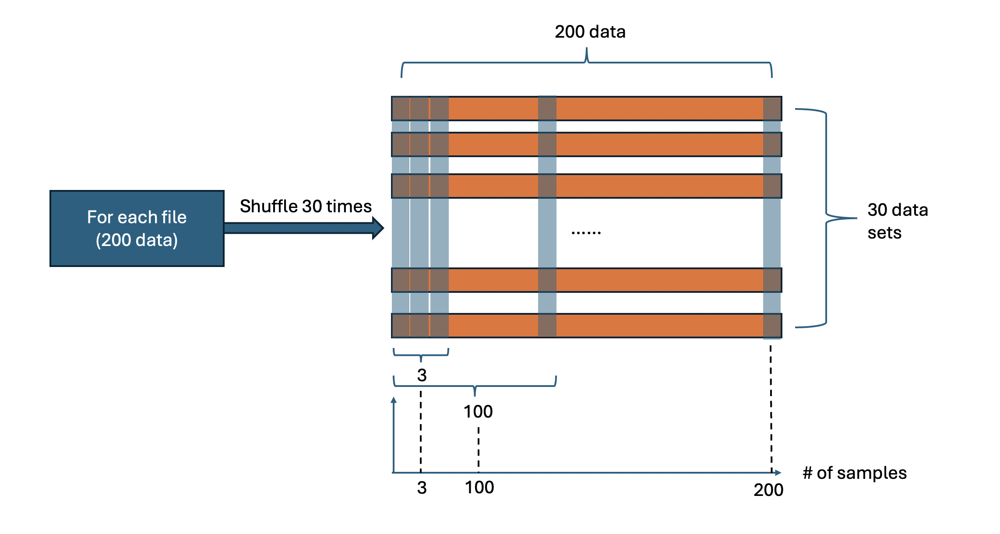

## Code Files Description

### Optimal Solution

1. **The plot of the optimal solution for a input file(`get_opt.py`)**

   - **Description:**  
     This script plot the revenue on the primary data for the optimal solutions obtained from different sample sizes in a file, given a specific sushi supply quantity k. 

     **Input:** The file name; The number(k) of sushi provided to the custome; The axis start, end, and interval of the plot

     **Output:** a graph (also the optimal solution for each cases)
     
   - **Running Instruction:**  
     Run the script using:
     ```
     python3 get_opt.py
     ```
     After executing, the terminal will prompt:
     ```
     Enter the filename:
     ```
     You can input a number like `5000_a.txt`, etc.
     
     Then, the terminal will prompt:
     ```
     How many sushi do you want to serve customers? (not more than 10): 
     ```
     You can input a number like `1`, `2`, `3`, etc.
     To get the axis start, end, and interval of the plot, the terminal will prompt:
     ```
     Enter start value:  
     Enter end value (inclusive):    
     Enter step size:
     ```
     You can input a number like (`1`, `5000`, `1`), etc.

   - **Logic of the code:**
     
     
     
2. **GPT comparation(`combine_smooth.py`)**
   - **Description:**  
     This compare the performance between GPT-4o and GPT-3.5-turbo, which draw the graph for no-persona, 0-shot and few shot for two GPT editions.

     **Input:** The number(k) of sushi provided to the custome

     **Output:** a graph (also the optimal solution for each cases)

   - **Running Instruction:**  
     Run the script using:
     ```
     python3 combine_smooth.py
     ```
     After executing, the terminal will prompt:
     ```
     How many sushi do you want to serve customers? (not more than 10): 
     ```
     You can input a number like `1`, `2`, `3`, etc.
   - **Logic of the code:**
     
### 
